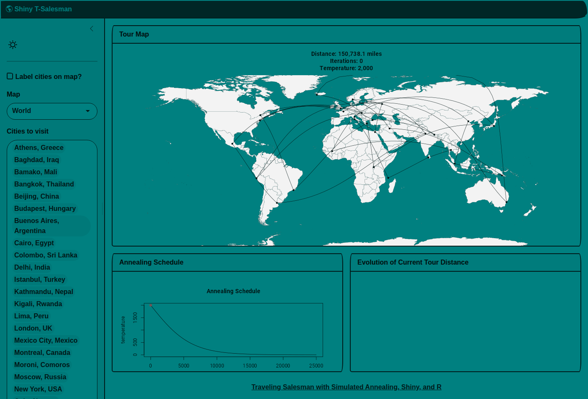

# Shiny T-Salesman

A modern Shiny app to solve the traveling salesman problem with simulated annealing. Based on [Todd Schneider's original implementation](https://toddwschneider.com/posts/traveling-salesman-with-simulated-annealing-r-and-shiny/).

## Features

- **Interactive map visualization** of city tours on World or USA maps
- **Simulated annealing optimization** with adjustable parameters
- **Dark/light mode toggle** for comfortable viewing
- **Modern UI** built with [bslib](https://rstudio.github.io/bslib/) and Bootstrap 5

## Demo



## Running Locally

```r
# Clone the repo
git clone https://github.com/dar4datascience/shiny-salesman.git
cd shiny-salesman

# Restore dependencies with renv
renv::restore()

# Run the app
shiny::runApp()
```

Or install and run directly:

```r
install.packages(c("shiny", "maps", "geosphere", "bslib"))
library(shiny)
runGitHub("shiny-salesman", "dar4datascience")
```

## Deployment

This app is deployed to GitHub Pages using [shinylive](https://posit-dev.github.io/r-shinylive/), which compiles the app to run directly in the browser (no R server required).

The deployment is automated via GitHub Actions—see [`.github/workflows/deploy-app.yaml`](.github/workflows/deploy-app.yaml).

## How It Works

1. **Select cities** from the dropdown or click "Set Cities Randomly"
2. **Adjust simulated annealing parameters** (S-curve amplitude, center, width, iterations)
3. **Click SOLVE** to run the optimization
4. Watch the algorithm converge on an optimal tour

The app uses the [simulated annealing](https://en.wikipedia.org/wiki/Simulated_annealing) algorithm to find near-optimal solutions to the traveling salesman problem, gradually "cooling down" to settle on a good tour.
